# Smart-Plant-Care-System-with-Indoor-Outdoor-Temperature-and-Humidity controllable through node-red and HiveMQ.
Project for the course Introduction to Applied IoT at Linnaeus University, Summer 2023.

Author: Djordje Dimitrov (dd222im)

# Project Description:

In this project, I'll be measuring the current stats of my living room, such as temperature and humidity, while also monitoring the soil moisture of my beloved plant. To accomplish this, I'll be using the RPI Pico W microcontroller. I've set up a water pump that can be controlled through the Node-RED UI or automated to activate when the moisture level becomes too low. Additionally, I'll configure webhook messages to notify me when the soil moisture drops below 10 percent, and I'll receive updates on the living room stats as well as confirmations when the flower is watered. Furthermore, I'll utilize the Node-RED UI to display the current stats of the living room and the soil moisture of the plant.

The project took approximately three weeks to complete, mainly due to waiting for parts to arrive and conducting multiple code tests. However, if you have all the necessary components and are familiar with Micropython and MQTT, you can finish the project in just 6-8 hours.

# Objective

The main idea behind this project came from a practical problem I face during the summer months. Whenever I'm away for a couple of weeks, my poor plant is left without water and care. So, I wanted to create a system that could monitor the soil moisture and water the plant when needed. Additionally, I wanted to keep an eye on the temperature and humidity levels in my living room.

Participating in this course gave me the perfect opportunity to dive into the world of microcontrollers and learn how to create a real-life smart home system. It's something I've always been interested in, and this project served as a great starting point for me.

Throughout the process, I gained valuable insights and practical knowledge. I learned how to work with microcontrollers, set up webhook messages, and use them to get notifications when the soil moisture drops below a certain point. I also discovered the power of Node-RED in creating a user-friendly dashboard to control and monitor the system.

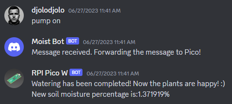 

Pretty cool, right??

# List of material

- Raspberry Pi Pico W
- Capacitive Soil Moisture Sensor
- DHT11 Temperature and Humidity Sensor
- A set of jumper wires (both m2m and m2f)
- Mini water pump 12V DC with 2m hose
- 12V DC or 9V DC power supply
- Relay module
- Micro USB cable
- Breadboard
  

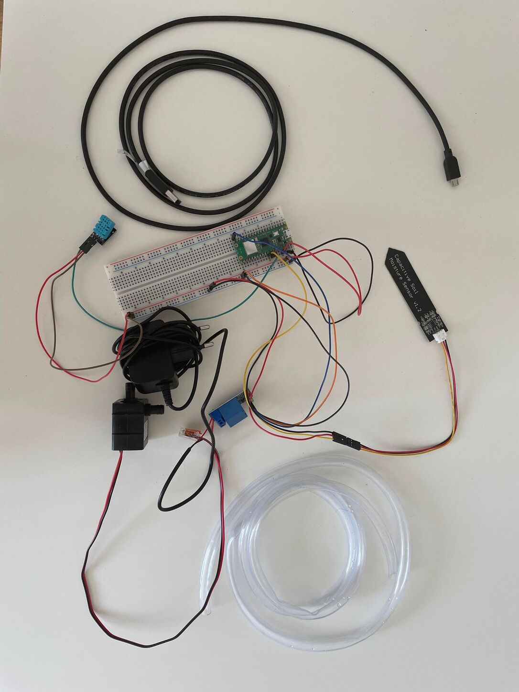

|Name |  Specification        | Cost      |   Bought at  |
|-------|----------------|-------|------------|
|Raspberry Pi Pico W    |   A microcontroller             |    98 sek  | electrokit.se  |
|DHT11 Temperature and Humidity Sensor | The sensor outputs serial data that can be read with a microcontroller |49 sek | electrokit.se  |
| Capacitive Soil Moisture Sensor  |Ground moisture sensor hygrometer module V1.2   | 67.99 sek |amazon.se  |
|A set of jumper wires| jumper wires m2m and m2f, 10 each  | 29 sek * 2| electrokit.se  |
|Mini water pump 12V DC with 2m hose| 12V DC mini water pump with 2m hose | 164 sek | amazon.se  |
|12V DC power supply| 12V DC power supply or in my case 9V DC power supply|around 100 sek| I had a spare one at home|
|Relay module| 5V relay module | 54.99 sek | amazon.se  |
|Micro USB cable| Micro USB cable | 29 sek | electrokit.se  |
|Breadboard| Breadboard | 29 sek | electrokit.se  |

# Computer Setup

The computer setup for this project was pretty simple. I just used VSCode with the PyMakr extension to write my code. With PyMakr, I could easily upload my code directly from the IDE to the microcontroller without the need for constantly plugging and unplugging it.

Using VSCode and PyMakr together made things super convenient. I could quickly test and debug my code without any hassle. It saved me a lot of time and made the whole development process much smoother.

The code is uploaded through the PyMakr extension in VSCode. The workflow is as follows:
1. Connect the microcontroller to the computer through the USB cable
2. Open the project in VSCode
3. Install the PyMakr extension
4. In the bottom left corner, click on the PyMakr icon, the new window will open
5. Create a new project and name it
6. Click on the 'Connect device' button in the top right corner
7. Click on the 'Sync project to device' button in the top right corner
8. Click on the 'Hard reset device' button in the dropdown menu in the top right corner
9. Click on the 'Connect device' button again and the microcontroller should start executing the code in the main.py file

Some extra steps might be needed to install the libraries that are used in the code, such as urequests, dht, and time. The libraries can be easily installed through the terminal on the Pico board, with mip. (works very similar to pip for desktop python). For example:
1. import mip
2. mip.install('urequests')

Additional installations: 
- Node.js - https://nodejs.org/en
- Node-red - https://nodered.org/docs/getting-started/local
- Node-red dashboard - https://flows.nodered.org/node/node-red-dashboard

# Putting everything together

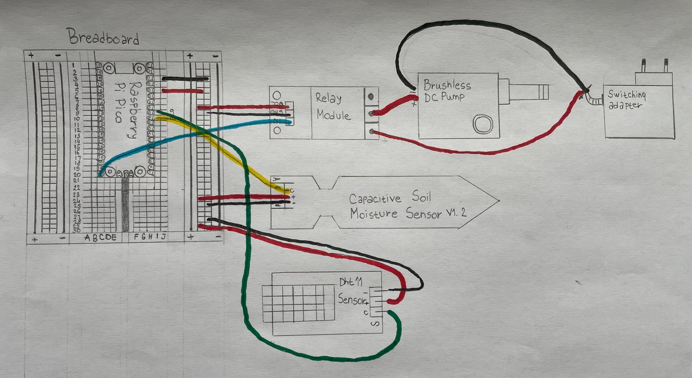 

I connected all the components to a breadboard, and then linked the breadboard to the Pico microcontroller. The Pico is like the brains of the operation—it controls the components using its GPIO (General Purpose Input/Output) pins and also provides power and ground connections.

To power the components, I connected the 3V3OUT and GND pins on the Pico (those are slots 36 and 38 on the Pico) to the corresponding power and ground rails on the breadboard.

I used different GPIO pins for each component:

Soil moisture sensor: Plugged into GPIO 26.
DHT11 sensor: Plugged into GPIO 27.
Relay: Plugged into GPIO 15.

# Platform

At first, I started off using AdafruitIO as my data storage platform because it was super easy to set up and had its own MQTT broker. It worked well, but as I got deeper into the project, I realized I wanted more control over the data and how it was presented. That's when I made the switch to Node-RED and HiveMQ.

Node-RED is awesome because it offers a ton of functionality and is commonly used for smart home systems. It gave me the flexibility I was looking for and allowed me to create a customized dashboard to control everything.

I also tried setting up a local MQTT broker called Mosquitto, but ran into some issues connecting it with the Pico. I'll definitely give it another shot in the future, but for now, I'm using HiveMQ. It's a cloud-based MQTT broker that's free for up to 25 connections and allows me to store up to 10 gigabytes of data. That's more than enough for my project, even if I decide to scale it up a bit.

One cool thing I discovered with Node-RED is that I can create a "phone app" by saving a localhost page. It's basically a mobile version of the user interface, so I can control and monitor everything right from my phone. It's super handy!

Overall, the switch to Node-RED and HiveMQ has been a game-changer. I now have more control over my data, a slick dashboard, and even a mobile app to manage everything. I like it a lot!

# The code

The code for this project is organized into different modules, with the main.py module being the heart of it all. It contains the main loop and functions that are called within that loop.

I've made sure to optimize the code so that it can run non-stop, 24/7, just like a real-life system should. The optimization here means that it's designed to use as little power as possible while still being awake and ready to respond to commands (idle mode). Additionally, during quiet night hours, the code puts the microcontroller into deep sleep state and save energy even more (deep sleep mode).

This power optimization is crucial because it ensures that the system can be used in a practical way without worrying about draining the battery or having to manually intervene all the time.

# Transmitting the data / connectivity

Currently, the data is being sent to the HiveMQ MQTT client every 30 minutes, but this can be easily modified based on personal preferences. For example, the code can be adjusted to publish data every 45 minutes or even every hour. It's a design choice that can be customized to suit specific needs.

To establish the connection and transfer data, I used the built-in Wi-Fi capabilities of the Pico microcontroller. It allowed me to connect to my home Wi-Fi network and communicate with the MQTT broker. MQTT was chosen as the communication protocol between the microcontroller and the broker.

I opted to use the HiveMQ MQTT broker for this project because it's free, user-friendly, and highly reliable. It provides a stable platform for publishing and receiving data. In terms of Wi-Fi range, my router is located in the same room as the project setup. However, even if the router was in another room, the Wi-Fi range typically covers the entire living area, ensuring smooth communication.

Energy consumption is an important consideration, as Wi-Fi tends to consume more power compared to other protocols like LoRaWAN. To mitigate this, I implemented optimizations in the code. For instance, I put the microcontroller into an idle state at the beginning of the main loop to conserve energy. Additionally, I incorporated a time check during program startup. If the time falls between 22:00 and 8:00, the Pico is put into a deep sleep mode for an hour, after which it reboots and performs the check again. This helps to significantly reduce energy consumption. While I haven't measured the exact energy usage, these steps should make a noticeable difference.

In terms of security, I ensure the Wi-Fi network is protected with WPA2 encryption to prevent unauthorized access. For MQTT security, I establish a secure connection to the HiveMQ broker using "ssl=True" and "ssl_params" to ensure data integrity and confidentiality.

# Presenting the data
- Node-red user interface from my desktop computer.
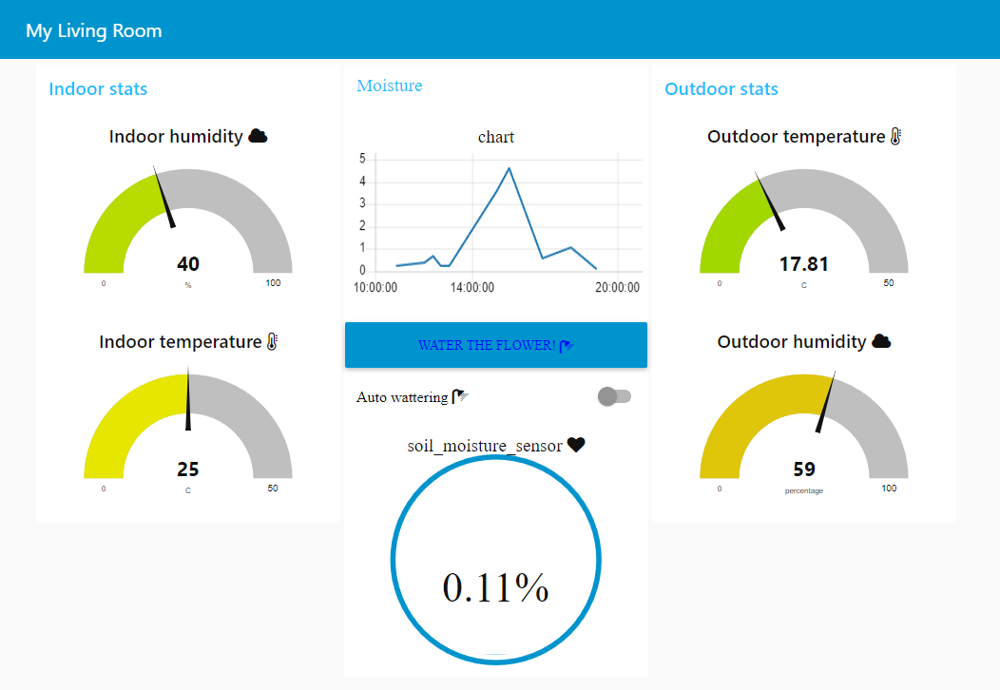

- Node-red user interface from my mobile phone.
  
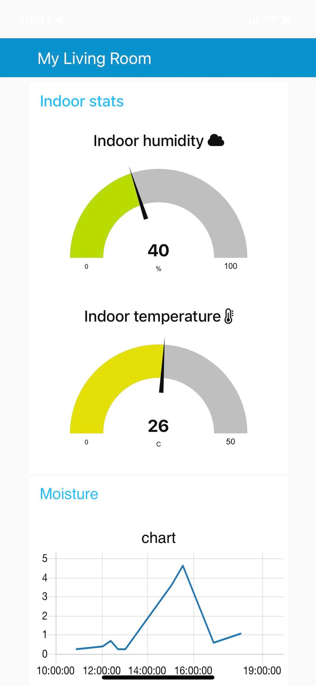 
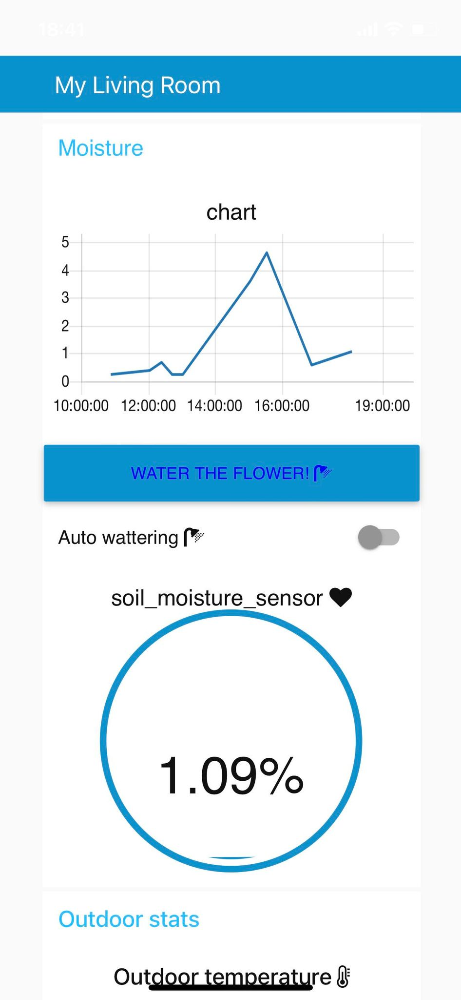 
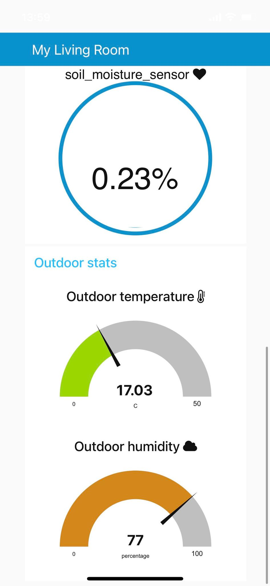 

- Discord webhook messages:
  
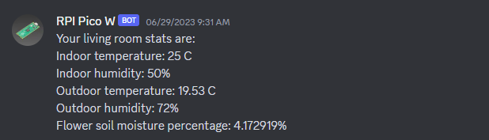 
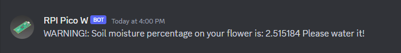 
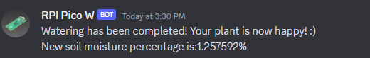 

In this project, I didn't incorporate a direct connection to a database as it wasn't necessary for its functionality. My focus was to have a user interface available at all times to check the current weather and living room stats. Therefore, there is no permanent storage of data. However, while the session is active, the data is temporarily saved in Node-RED.

The main automation feature of this project revolves around controlling the water pump through the Node-RED user interface. I utilized the Node-RED dashboard UI to create a button for watering the flower and a switch to enable or disable automatic watering. When automatic watering is turned on, the system continuously checks the moisture percentage during each iteration of the main loop. If the moisture level falls below 10%, the pump is activated for 5 seconds to water the flower. In the subsequent iterations, the code performs the same moisture check. If the moisture level is above 10%, the pump won't be turned on, but the code will keep checking as long as the "Auto watering" switch remains on. Additionally, the pump can be manually activated at any time by pressing the "water the flower" button on the Node-RED dashboard UI. It triggers the same action as automatic watering but isn't dependent on the switch.

Auto watering switch (taken from console output):
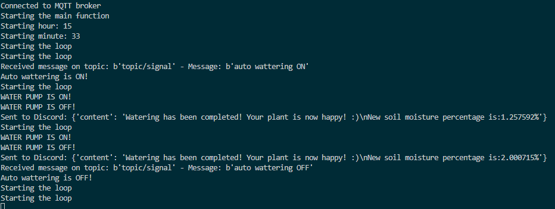 

Watering the flower button (taken from console output):
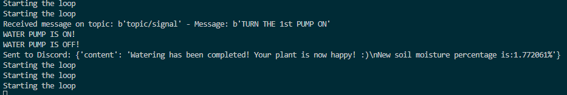

In addition to the main automation features mentioned earlier, there are a couple of additional automations in this project. First, the code publishes MQTT messages to the broker every 30 minutes. This allows the system to regularly send updates on the living room stats, such as temperature and humidity.

Second, if the moisture level falls below 10%, the code sends Discord webhooks every 4 hours. This serves as a notification mechanism to alert the user about the low moisture condition of the plant. By periodically checking the moisture percentage and comparing it to the predefined threshold, the system can determine when to trigger these webhook messages.

These additional automations ensure that the user stays informed about the living room stats and receives timely notifications regarding the plant's moisture level. It enhances the overall monitoring and control capabilities of the system.

In summary, the project combines various automations, including MQTT message publishing, Discord webhook notifications, and moisture level monitoring, to create a comprehensive and efficient system for managing the living room environment and plant care.

# Finalizing the design

Flower(front side)
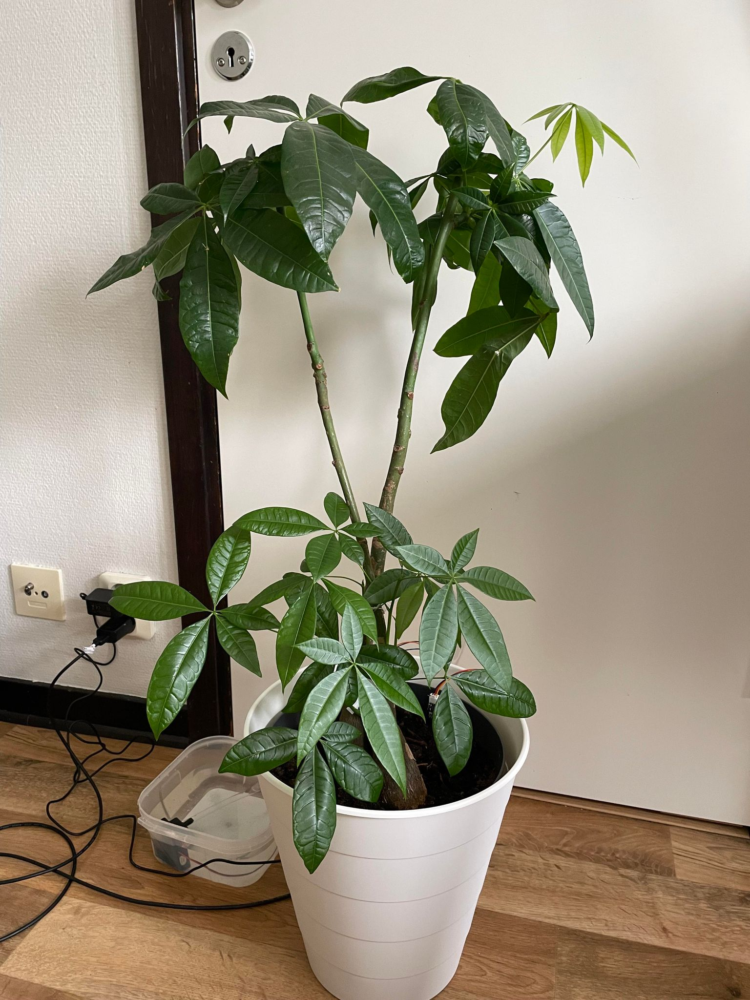

Flower(back side)
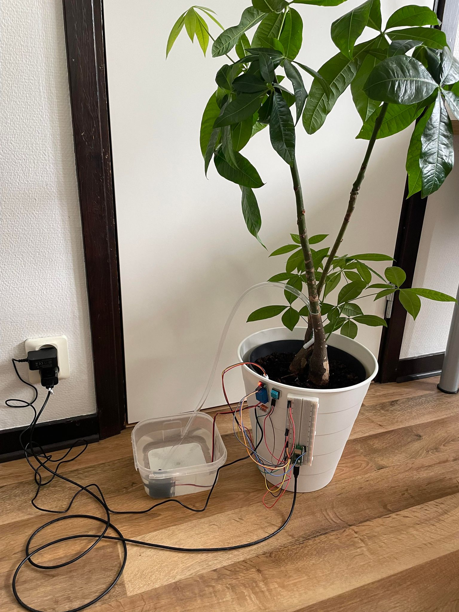

Flower(back side, close up)
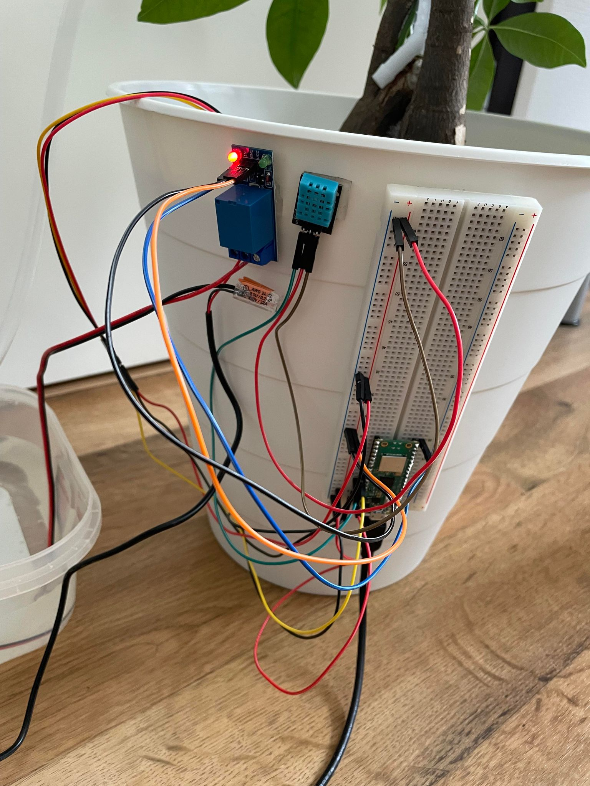

Flower(hose, splitter)
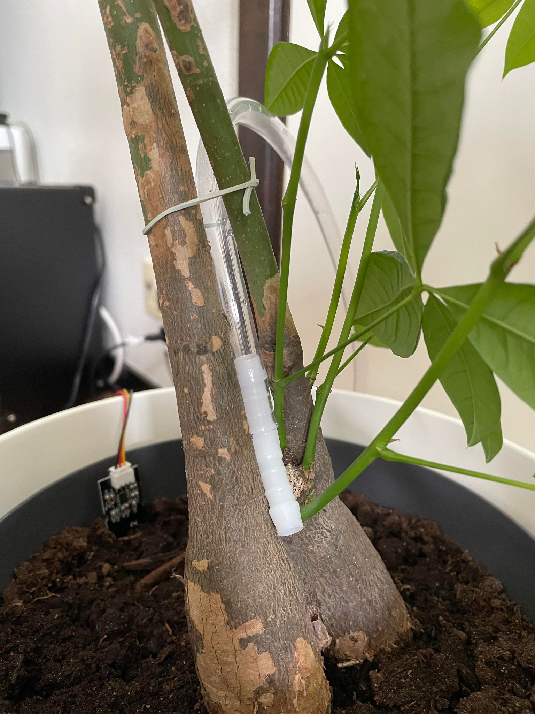

Flower(hose, splitter, moisture sensor)
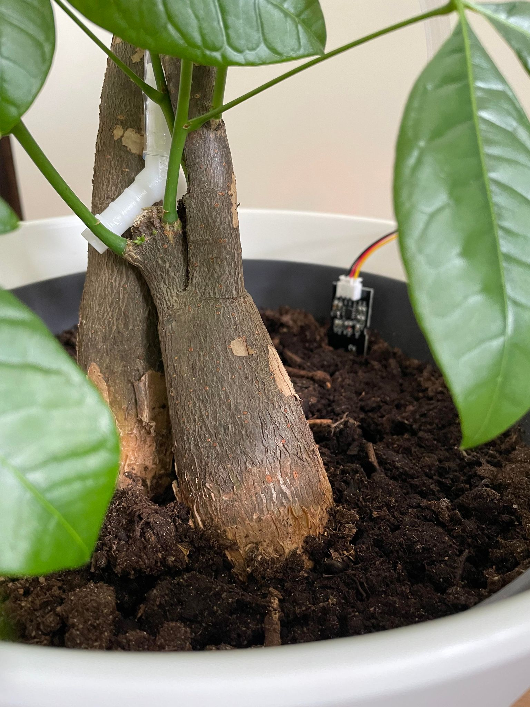

The project turned out to be way more fun then I expected. I did not had any experiece with IoT before, and this was a very fun way for me to gain deeper knowledge and understanding of the subject. I am very happy with the result and I will definitely continue working on IoT related project in future. By following this project, I hope you will be able to learn something new and have fun as well!
