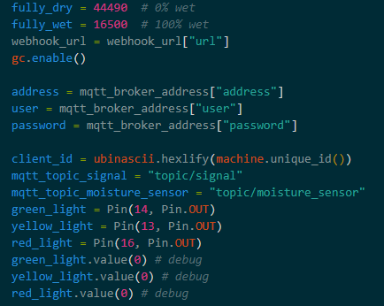
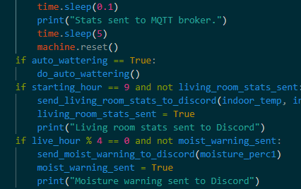
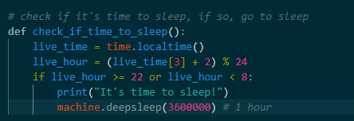
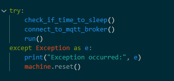

# Living Room Stats with self-watering flower pot controllable through node-red and HiveMQ.
Project for the course Introduction to Applied IoT at Linnaeus University, Summer 2023.

Author: Djordje Dimitrov (dd222im)

# Project Description:

In this project, I will measure the current living room stats, including temperature and humidity, as well as the soil moisture of my lovely plant. I will be using the RPI Pico W as my microcontroller and setting up webhook messages to notify me when the soil moisture drops below 10 percent. In addition to that, I have set up a water pump that can be controlled either through node-red ui or set up to work automatically when the moisture is bellow a certain point. 
The amount of time it took me to complete this project was around 3 weeks as I had to wait for the parts to arrive and to test my code many times. If you have all the parts, the project can be finished in 6-8 hours.

# Objective

The idea for this project came with the interest of solving a problem that I have during summer days, as I am usually away for a couple of weeks and my flower is left alone.
I wanted to create a system where I can monitor the soil moisture and water the plant when needed, as well as monitor the temperature and humidity of the room. 

The main purpose when applied for the course is to learn how to use the microcontroller in order to create a system that can be used in real life. I always had a great interest in building a smart home system, and this is a great start for me to learn how to do it.

The insights that I gained from this project are that I can use the microcontroller to create a system that can be used in real life, and that I can use node-red to create a dashboard and control the system. I also learned how to set up webhook messages and how to use them to notify me when the soil moisture drops below a certain point.

# List of material

- Raspberry Pi Pico W
- Capacitive Soil Moisture Sensor
- DHT11 Temperature and Humidity Sensor
- A set of jumper wires (both m2m and m2f)
- Mini water pump 12V DC with 2m hose
- 12V DC or 9V DC power supply
- Relay module
- Micro USB cable
- Breadboard
  

|Name |  Specification        | Cost      |   Bought at  |
|-------|----------------|-------|------------|
|Raspberry Pi Pico W    |   A microcontroller             |    98 sek  | electrokit.se  |
|DHT11 Temperature and Humidity Sensor | The sensor outputs serial data that can be read with a microcontroller |49 sek | electrokit.se  |
| Capacitive Soil Moisture Sensor  |Ground moisture sensor hygrometer module V1.2   | 67.99 sek |amazon.se  |
|A set of jumper wires| jumper wires m2m and m2f, 10 each  | 29 sek * 2| electrokit.se  |
|Mini water pump 12V DC with 2m hose| 12V DC mini water pump with 2m hose | 164 sek | amazon.se  |
|12V DC power supply| 12V DC power supply or in my case 9V DC power supply|around 100 sek| I had a spare one at home|
|Relay module| 5V relay module | 54.99 sek | amazon.se  |
|Micro USB cable| Micro USB cable | 29 sek | electrokit.se  |
|Breadboard| Breadboard | 29 sek | electrokit.se  |

# Computer Setup

The computer setup is fairly simple as I used VSCode with PyMakr extension to work on my code. PyMark allows uploading of the code directly from the IDE to the microcontroller, which is a convinient solution for testing as it does not require constant plugging and unplugging of the microcontroller.

The code is uploaded through the PyMakr extension in VSCode. The workflow is as follows:
1. Connect the microcontroller to the computer through the USB cable
2. Open the project in VSCode
3. Install the PyMakr extension
4. In the bottom left corner, click on the PyMakr icon, the new window will open
5. Create a new project and name it
6. Click on the 'Connect device' button in the top right corner
7. Click on the 'Sync project to device' button in the top right corner
8. Click on the 'Hard reset device' button in the dropdown menu in the top right corner
9. Click on the 'Connect device' button again and the microcontroller should start executing the code in the main.py file

Some extra steps might be needed to install the libraries that are used in the code, such as urequests, dht, and time. The libraries can be easily installed through the terminal on the pico board, with mip (works very similar to pip for desktop python). For example:
1. import mip
2. mip.install('urequests')

Additional installations: 
- Node.js - https://nodejs.org/en
- Node-red - https://nodered.org/docs/getting-started/local
- Node-red dashboard - https://flows.nodered.org/node/node-red-dashboard

# Putting everything together

All of the components are connected to the breadboard, which is then connected to the microcontroller. Pico is responsible for controlling the components through the GPIO pins, and also providing power and ground to the components. I used 3V3OUT and GND (slot 36 and 38 on pico), to connect the side of the breadboard that is responsible for providing + and - to the components. 
GPIO pins are used to connect the components to the microcontroller. The pins that are used are:

- Soil moisture sensor - GPIO 26
- DHT11 - GPIO 27
- Relay - GPIO 15

# Platform

At first, I have used AdaFruitIO as my platform for storing data, as it was very easy to set up and it had it's own MQTT broker. However, in the last two weeks of the project I switched to Node-red and HiveMQ as I wanted to have more control over the data and the way it is presented. I also wanted to have a dashboard that I can use to control the system. Node-red provides much more funcionality and it's commonly used for smart home systems, so I decided to switch to it. I also tried setting up a local MQTT broker (mosquitto), but I had some issues with it because I could not connect pico to it. I will try to set it up again in the future, but for now I am using HiveMQ. HiveMQ is a cloud MQTT broker that is free to use for up to 25 connections, which is more than enough for my project. In addition to that, it allows up to 10 gigabytes of data to be stored, which is also more than enough for my project. Even with a higher scale project, if data sent is limited (for example once every one or two hours), it would be enough to store the data for a very long time.
Very convinient thing I also discovered on Node-red is that it is possible to create an 'app' on the phone (basically just a saved localhost page), to control and see the complete UI, as on desktop. I like it a lot!

# The code

There are several modules included in the code, where main.py is the main module run on my microcontroller (consists of the main loop and the functions that are called in the loop). 
The code has been optimized to run 24/7 as it is supposed to be used in real life. By optimized, I mean using as little power as possible but being in the awake state to listen for commands, and sleeping during night hours.
I will not go through the code line by line of explaining every single details but I will go through the functins that I implemented and explain what they do and how they work. I will also explain the main loop. 

- fully_dry and fully_wet variables are manually predefined by testing the moisture humidity sensor in completely wet and completely dry soil. The values are then used to calculate the percentage of moisture in the soil.
- gc.enable() is used to enable garbage collection, which is used to free up memory. It is used to prevent memory leaks and to free up memory that is no longer needed.
- led lights are used to indicate the state of the system. The lights are completely optional as they do not affect the functionality of the system. I used them for debugging purposes and to see if the system is working as intended when plugged into a wall socket, since there's no other way to see if the system is working or not. Maybe a LED screen would be a better option, but I did not have one at hand.

There are several functions that are used in the main loop, related to mqtt broker, discord webhooks, and the main functionality of the system. I will skip these but I will provide comments in the code to explain what each function does.

- The main run function starts by putting the machine into idle state in order to lower the electricity consumption as the microcontroller still responds and does all the work required even by being into idle state. The starting time is fetched from the time module and is used to calculate the loop time. The outdoor stats are collected from the openweather API at this point as I did not want to spam the API requests at every loop iteration.
- The While true loop starts by collecting the data from the sensors and calculating the new live time, the same way as from the start of the run() function. The system currecntly publishes data every 30 minutes, and this is done by comparing the starting_time and live_time variables. This is done to prevent spamming the MQTT broker with data, as it is not necessary to publish data every second. The data is published to the MQTT broker, and the system goes into idle state again. The line of code:
  - if (starting_minute < 30 and (starting_minute + 30 == live_minute)) or (starting_minute >= 30 and (starting_minute - 30 == live_minute)) checks if the time has come to publish the data, and this can easily be modifed to publish the data every 45 minutes, or every hour, depending on the need. For example:
  - if (starting_hour + 1 == live_hour) will publish the data every hour.
- After publishing the machine.reset() is called to hard-reset the microcontroller and to start the execution of the main.py file again. This is done in order to prevent memory leaks and to free up memory that is no longer needed. I had a lot of problems with memory leaks and the system crashing after a few hours of running(or several webhooks sent), so I figured out that this might be the best solution (for my project at least).

- Inside the main loop, there are also several if statement checks to see when to send webhooks to discord. For example, I set up a discord webhook at 9 am every morning to sent me current data measured. Also, every 4 hours, if the flower moisture is very low (bellow 10%), I get warnings on discord to water the flower. This is done by checking the moisture percentage and comparing it to the predefined values. 

- The system is also programmed to go into deep sleep if time is between 22:00 and 8:00, since I thought there is no need for it to run while I am not awake. The deepsleep is set to 1 hour (3600000ms), after that the system restarts, checks again, and does that over and over again. This is also mostly implemented to save power and lower the electricity consumption.
  

- Finally, all the necesarry functions are wrapped inside the try/except block to prevent the system from crashing if an error occurs. If something unexpected happend, the system will reset and start again. This is necesarry in order for system to run unattended for a long period of time.

# Transmitting the data / connectivity

- The data is currently being sent to the HiveMQ mqtt client every 30 minutes. However, this is a design choice, and can easily be modified to some other value. For example:
  - if (starting_minute < 30 and (starting_minute + 30 == live_minute)) or (starting_minute >= 30 and (starting_minute - 30 == live_minute)) checks if the time has come to publish the data, and this can easily be modifed to publish the data every 45 minutes, or every hour, depending on the need. For example:
  - if (starting_hour + 1 == live_hour) will publish the data every hour.

- I used Wifi connection available on Pico.
- For transport protocolls I used MQTT for communication between the microcontroller and the MQTT broker, and I used webhook messages to receive data or other type of messages on discord.
- My data is published through my home wifi over the MQTT broker, and I used the HiveMQ broker for this project. I used the HiveMQ broker because it is free and easy to use, and it is also very reliable. When it comes to range of the wifi, my router is in the same room, but this project would work even if the router was in another room, as the range of the wifi usually covers the entire living area. 
- When it comes to energy consumption, Wifi tipically consumes more power then lorawan, this is why optimizing the code is a good idea if a device is supposed to be running all the time. I did some optimizations by putting the machine into idle state as soon as the main loop starts, as I notice that microcontroller still does all the work even when put into idle. Another modification I did is to perform a time check whenever the program starts. If the time is between 22:00 and 8:00, pico is put into a deep sleep mode for an hour, after which it reboots and performs the check again. This is done to lower the energy consumption. I haven't measured the exact consumption of the device but I belive by doing this steps the energy consumption is lowered by a lot.
- When it comes to security, my WIFI is encrypted with WPA2 protocol to prevent unauthorazied acess. For MQTT security, I used ssl=True and ssl_params to establish a secure connection to the HiveMQ broker. 

# Presenting the data
- Node-red user interface from my desktop computer.

- Node-red user interface from my mobile phone.
  
 
 
 

- I have no direct connection to any database as it was not necesarry for this project to work. My idea was to always have user interface available to check the current weather outside and current living room stats, so saving this data in my opinion was not necesarry. However, the data is temporarily saved to node-red while the session is active. 
- The main automation feature in this project is the way the water pump can be controlled from the node-red UI. I used the dashboard UI to create a button for watering the flower, and a switch to turn automatic watering on or off. When auto watering is turned on, the system will check for moisture percentage in every iteration of the main loop. If moisture is bellow 10%, the pump will turn on for 5 seconds and water the flower. In the next iteration of the main loop, the code performs the same check, but in next case the moisture will be above 10% so the pump will not be turned on, but the code will continue checking for as long as the switch for 'Auto wateering' is turned on. In addition, the pump can be manually turned on at any point by pressing the button "water the flower" on the dashboard UI. It performs the same action as the automatic watering, but it is not dependent on the switch.

Auto watering switch (taken from console output):
 

Watering the flower button (taken from console output):

- Some additional automation are publishing mqtt messages to the broker every 30 minutes, and sending discord webhooks every 4 hours if the moisture is bellow 10%. This is done by checking the moisture percentage and comparing it to the predefined values.
# Finalizing the design

Flower(front side)

Flower(back side)

Flower(back side, close up)

Flower(hose, splitter)

Flower(hose, splitter, moisture sensor)

